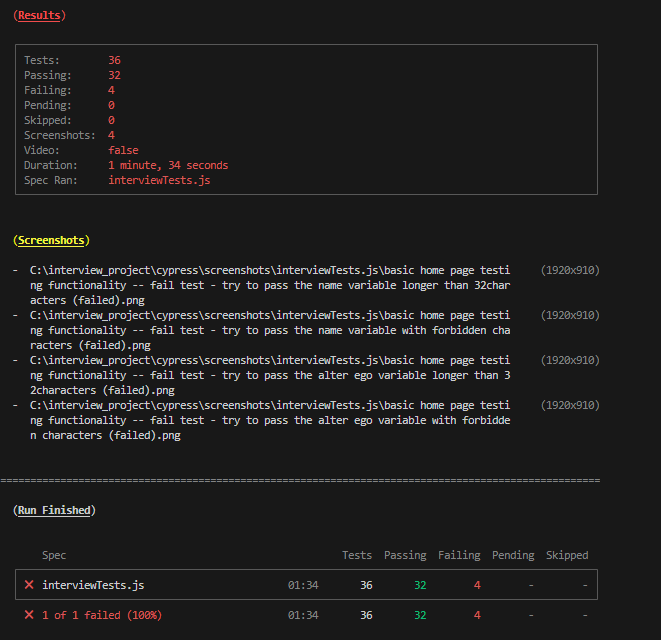

# Interview Project
### Cypress Test Automation Project
---


#### About

This is an interview project made by me in Cypress framework.
The E2E Tests are made for that page [https://angular-qa-recruitment-app.netlify.app/]

#### Test Cases

I have created **36** End-to-End test cases. The **4** of them are on purpose **failing** -> made an validation for entering too long and appropriate characters in input fields for name and alter ego in Form Page.

- home Page tests 
- form Page tests
- stepper Page tests



#### Setup Guide

Bellow instruction for installing the project locally on machine

1. Clone the repo 
```
git clone https://github.com/CzajkowskiWiktor/interviewProject.git
```
2. Install NPM packages
```
npm install
```
3. Install Cypress framework (**used 13.2.0**)
```
npm install cypress
```
4. Install NPX package
```
npm install npx
```

##### Run the Project

To run the project tests you launch by 2 ways:

- opening the Cypress UI
> To run project by Cypress UI copy to terminal that command:
```
npx cypress open
```
- in terminal window
I created 2 scripts to launch testing
```javascript
"triggerAllTests-headless": "npx cypress run --headless",
"triggerAllTests-chrome-headed": "npx cypress run --browser chrome --headed"
```
To run a tests, copy and paste to terminal:
- headless mode
```javascript
npm run triggerAllTests-headless
```
- Or chrome headed
```javascript
npm run triggerAllTests-chrome-headed
```

##### Own Validation for Input fields
```javascript
fillTheNameInputValue(name) {
    //accept only a-z characters without numbers with optional space
    var regExpression = /^[A-Za-z]+( [A-Za-z]+)*$/;

    if (name.length > 32) {
      throw new ValidationError(`"${name}" is longer than 32 characters`);
    } else if (!regExpression.test(name)) {
      throw new ValidationError(`"${name}" does not match regex expression`);
    } else {
      cy.get("#name").clear().type(name).should("have.value", name);
    }
  }
```

```javascript
fillTheAlterEgoInputValue(alterEgo) {
    //accept any word characters without numbers with optional space
    var regExpression = /^\w+( \w+)*$/;
    if (alterEgo.length > 32) {
      throw new ValidationError(`${alterEgo} is longer than 32 characters`);
    } else if (!regExpression.test(alterEgo)) {
      throw new ValidationError(
        `"${alterEgo}" does not match regex expression`
      );
    } else {
      cy.get("#alterEgo").clear().type(alterEgo).should("have.value", alterEgo);
    }
  }
```